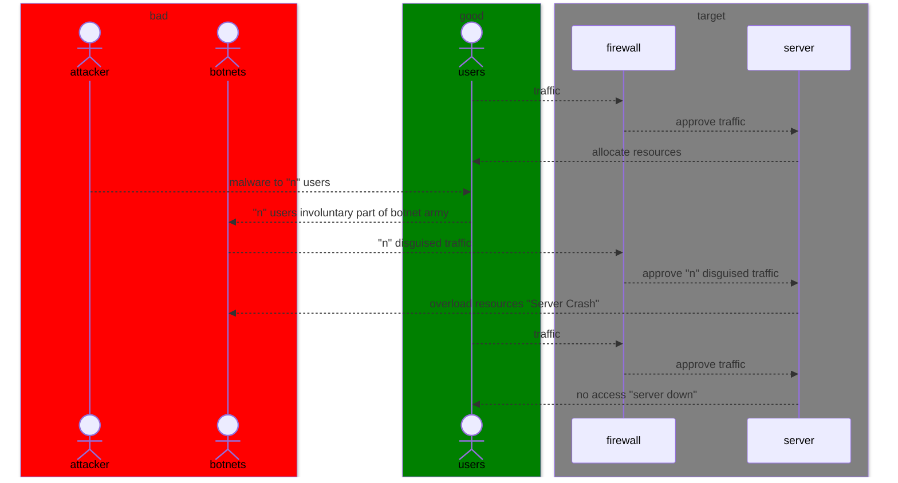

# Lab 2: Mermaid Diagrams
## Assignment: Creating a Sequence Diagram for a Network Attack Scenario

[Source of understanding](https://www.youtube.com/watch?v=z503nLsfe5s)

### Diagram Explanation

**Participants**
* _attacker_ - A hacker who creates and controls a botnet to flood a target with traffic and disrupt its services. (chatGPT4)
* _botnets_ - A botnet is a network of infected computers or devices controlled by a hacker to carry out cyberattacks without the owners knowing.
* _users_ - day-to-day normal users of the server
* _firewall_ - A firewall is a security system that monitors and controls incoming and outgoing network traffic
* _server_ - A server is a powerful computer or system that stores, processes, and delivers data, services, or applications to other computers (clients) over a network.

Definitions provided by OpenAI. (2025). ChatGPT (Feb 16 version) \[Large language model\]. [https://openai.com](https://openai.com)

### Sequence of Events
1. _traffic_ - User types in a URL they want to go to.
2. _approve traffic_ - Users request is approved by the firewall and granted access to the server of the application.
3. _allocate resources_ - The applications servers allocates resources to the user to interact with the applicaion.
4. _malware to "n" users_ - Attacker infects unsuspecting computers with malware.
5. _"n" users involuntary part of botnet army_ - The aggregate of all users with malware on their computers is now part of the botnet army.
6. _"n" disguised traffic_ - Attacker tells the botnet army complied of normal users to target the application all at once.
7. _approve "n" disguised traffic_ - The botnet disguised as normal users are granted access from the firewall to the applications server.
8. _overload resources "Server Crash"_ - The server provides resources to allow access to the botnet and is overloaded causing the servers to crash.
9. _traffic_ - A user not part of the botnet army wants to access the application.
10. _approve traffic_ - The users is approved.
11. _no access "server down"_ - The user is not able to interact with the server becasue all the servers resources are being allocated to the botnet army.