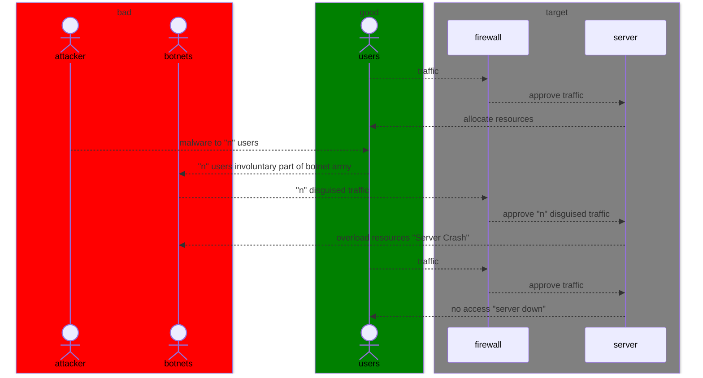

# Lab 2: Mermaid Diagrams
## Assignment: Creating a Sequence Diagram for a Network Attack Scenario

### Diagram Explanation

**Participants**
* _attacker_ - A hacker who creates and controls a botnet to flood a target with traffic and disrupt its services.
* _botnets_ - A botnet is a network of infected computers or devices controlled by a hacker to carry out cyberattacks without the owners knowing.
* _users_ - day-to-day normal users of the server
* _firewall_ - A firewall is a security system that monitors and controls incoming and outgoing network traffic
* _server_ - A server is a powerful computer or system that stores, processes, and delivers data, services, or applications to other computers (clients) over a network.