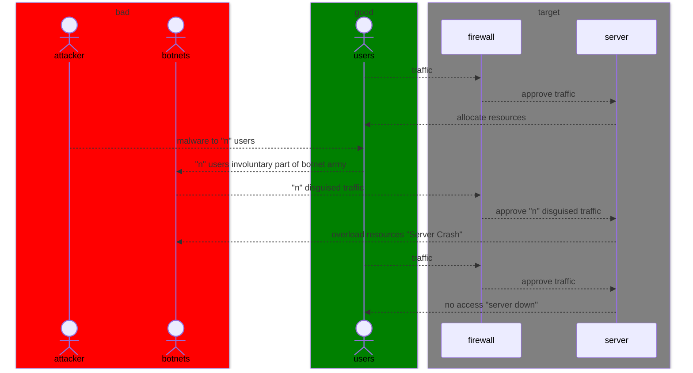

```mermaid
sequenceDiagram
    box red bad
    actor attacker
    actor botnets
    end    
    box Green good
    actor users
    end
    box grey target
    participant firewall
    participant server
    end
    users-->>firewall: traffic
    firewall-->>server: approve traffic
    server-->>users: allocate resources
    attacker -->>users: malware to "n" users
    users-->>botnets: "n" users involuntary part of botnet army
    botnets-->>firewall: "n" disguised traffic
    firewall-->>server: approve "n" disguised traffic
    server-->>botnets: overload resources "Server Crash"
    users-->>firewall: traffic
    firewall-->>server: approve traffic
    server-->>users: no access "server down"
```
